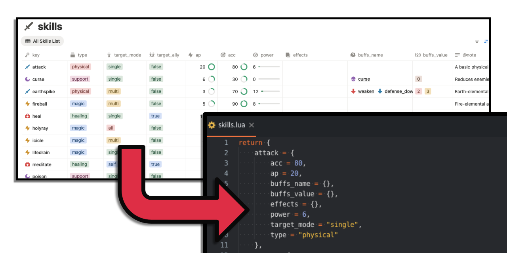
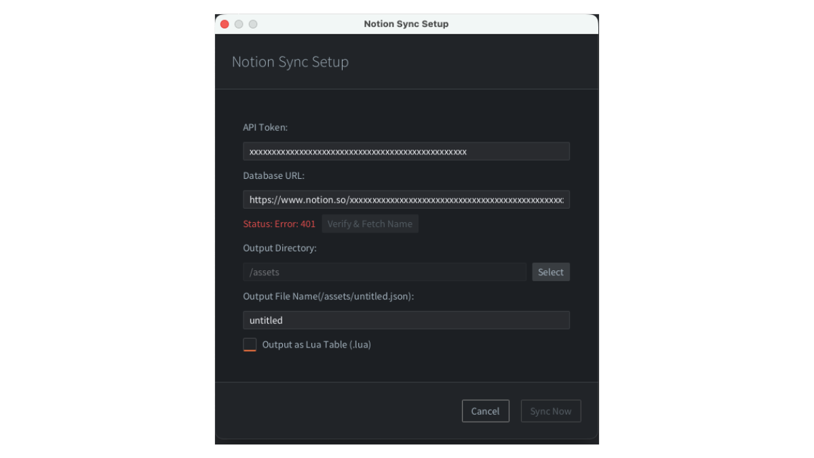
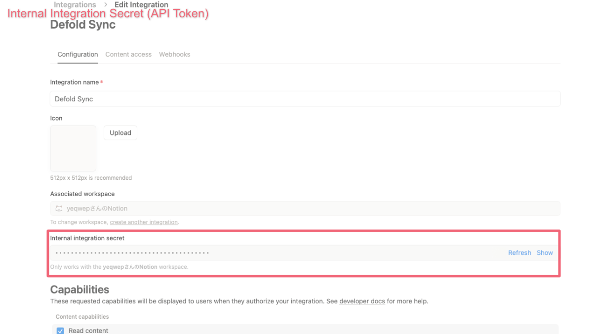
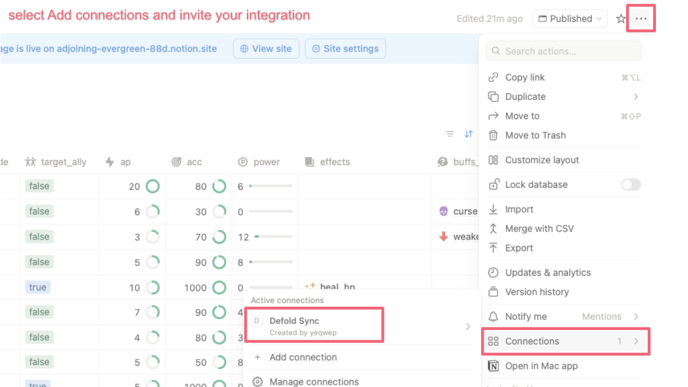

# Notion to Defold Sync Tool

Sync Notion databases directly into Defold projects
as Lua tables or JSON.


---

## ✨ Overview

This is a **Defold Editor Script** that allows you to directly import Notion databases into a Defold project and export them as **Lua tables** or **JSON**, optimized for in-game usage.

Game data such as item masters, enemy stats, and localized text can be managed in Notion and synced from within the Defold Editor—without relying on external tools.



---

## ⭐ Features

### Seamless Sync

Calls the Notion API directly from the Defold Editor
(**Project > Sync from Notion URL**), without any intermediate tools.

### Pagination Support

Fully supports large databases with more than 100 entries.

### Smart Data Formatting

Automatically reshapes and converts Notion data into structures and types that are ideal for game development (details below).

---

## 📦 Installation

1. Copy the `editor_scripts` folder from this repository into your Defold project.
2. In the Defold Editor, select **Project > Reload Editor Scripts**.
3. If **"Sync from Notion URL"** appears in the **Project** menu, the installation was successful.

---

## 🔑 Prerequisites

To use the Notion API, you need a Notion integration (API token).

1. Visit **Notion Developers** and create a new integration.
2. Obtain the **Internal Integration Secret (API Token)**.



3. Open the Notion database you want to sync.
4. From the top-right `...` menu, select **Add connections** and invite your integration.



---

## ▶️ Usage

1. In the Defold Editor, click **Project > Sync from Notion URL**.

2. Enter the following in the dialog:

   * **API Token**: The secret token obtained from Notion.
   * **Database URL**: The URL of the Notion database you want to sync.

3. Click **Verify & Fetch Name** to test the connection.
   If successful, the database name will automatically be filled in as the file name.

4. Click **Select** and choose the destination folder for the output data.

   **📝Note:**
   Only folders inside the current Defold project are supported.
   Even if you select an external folder, the tool will create a corresponding folder *inside* the Defold project.

5. Choose the output format (**Lua** or **JSON**) and click **Sync Now**.

**📝Note:**
The API token and output directory are saved locally in `notion_config.lua`, so you won’t need to re-enter them next time.  
⚠️ **Be careful not to share this file with others!**


---

## 🧩 Smart Data Formatting Rules

This tool automatically converts Notion’s flat database structure into multidimensional arrays and properly typed data that are easy to handle in code.

### 1. Auto Type Conversion

Certain string values entered in text or select properties are automatically converted to appropriate Lua types.

* Numbers (`"100"`, `"-5.5"`) → `number` (`100`, `-5.5`)
* `"true"`, `"false"` → `boolean` (`true`, `false`)

---

### 2. Exclude Prefix (`@`)

If a property (column) name starts with `@`, that column is excluded from the output.

Useful for notes or management-only fields that you want to keep in Notion but not in the game data.

**Examples:**
`@Memo`, `@Check` → Not included in output

---

### 3. Key Property (Hash Key)

If your database has a column named `key`, its value will be used as the index key for the output data.
This converts a regular array into a dictionary-style table.

**Notion Example:**

* key: `"apple"`
* color: `"red"`
* price: `100`

**Lua Output:**

```lua
return {
    apple = {
        color = "red",
        price = 100
    }
}
```

---

## 🗃 Database Example Template
[Visual Example](https://adjoining-evergreen-88d.notion.site/308ebb9a85c280a9a41dfcb0c2363ee4?v=308ebb9a85c281a58dcb000c3f7f46c5)

This is a sample site showing the visual design of the database. An editable template will be released soon.

---

## 🖥 Tested Environment

* Defold 1.11.2

---

## 📄 License

MIT License

---

## ℹ️ Additional Notes

This tool differs in behavior from a similar editor script I previously created:

**CSV to Lua Table Defold EditorScript**
[https://github.com/yeqwep/csv2lua-defold_editor](https://github.com/yeqwep/csv2lua-defold_editor)

In particular, because it is not possible to directly retrieve keys from related databases via relations, additional steps—such as using rollup properties—are required when working with relations.

---

**🎉 Happy folding! 🎉**

---